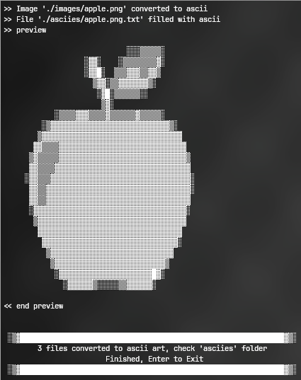

# Image to ASCII art file

- Create ASCII art file from image file



## Before Usage(install dependencies)

You need to install these before running the app:

- [Pillow](https://pillow.readthedocs.io/en/stable/)
  Just run:
  `pip install pillow`

## Usage

### Step 0. Go to anywhere you like to clone project

- `git clone https://github.com/TohidEq/py-img-to-ascii && cd py-img-to-ascii`

### Step 1. Copy your images into `images` folder

your images must be `.png`

### Step 2. Configure (Optional)

Edit `main.py` by any editor you want

Change value of `Consts` in top of file:

### Help

`SHOW_PREVIEW`: print preview of every ASCII

`CUSTOM_SCALE` is the base of scale images to ASCII, if you set it to :

- `"w"`:means `width`, ASCII's `width` will be scale to `CUSTOM_WIDTH` and auto calculate the `height`
- `"h"`:means `height`, ASCII's `height` will be scale to `CUSTOM_HEIGHT` and auto calculate the `width`
- `"b"`:means `both`, ASCII's `width` will be scale to `CUSTOM_WIDTH` and `height` will be `CUSTOM_HEIGHT`
- `"n"`:means `none`, ASCII will not be scale and it is same as the image size

`CUSTOM_CHARACTERS`: What you want to fill your ASCII with? Put them there, just remember to attention to order: `from the darkest char, to the brightest char`

```python
# True or False, preview of ascii
SHOW_PREVIEW = True

# "w"=width, "h"=height, "b"=both, "n"=none
CUSTOM_SCALE = "w"
# width/height character
CUSTOM_WIDTH = 50
CUSTOM_HEIGHT = 100

# Darkest character to the brightest character
CUSTOM_CHARACTERS = "█▓▒░ "

```

### Step 3. Run `main.py` by typing `python main.py` in your terminal
